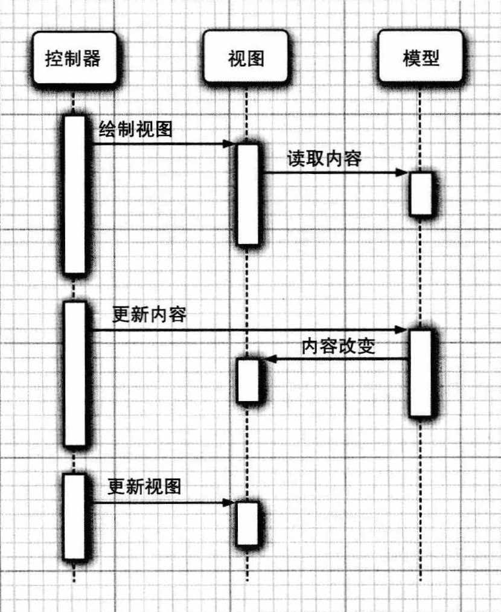

# <!-- fit --> 程序设计范式和GUI设计简介

<p align="right">复旦大学 2022级 傅全通</p>

---

## 目录

- 演示撰写的GUI程序
- 简介程序设计的多种范式
- 在C语言里简单实现面向对象、函数式、泛型编程
- GUI设计的范式（以Javax.swing为例）
- 用“C语言”结合第三方库设计简单的GUI程序

---

## 简介程序设计的多种范式

~~提一嘴即可~~

- 面向过程(procedural)
- 面向对象(object-oriented)
- 函数式(functional)
- 泛型(generic)
- 元编程(metaprogramming)

下面**简介**面向对象编程，宗旨是帮助大家建立**基本认知**。

---

## 面向过程(procedural)

*这个无需多说，我们十分熟悉。*  
如果要设计的过程过于复杂，
时刻铭记 **“自顶向下，逐步求精”**

*（引1）* 使用 **函数(function，面向对象编程的基本单元)** 来隐藏数据和算法的好处：  
（不讲解这段文字，只是发给大家）

```md
1. 让以后的工作更加轻松。  
你只需要使用一个之前写的函数就行了，而不是一直记着怎样实现算法逻辑。只要你相信该函数对于合法的输入都能正常工作，就可以信任它的输出而不需要
记得它是如何工作的。
2. 一旦你能够信任某个函数“可以工作”（比如库函数），就可以开始一遍遍地使用它来写代码解决问题。你无需担心任何细节（像如何访问棋盘），这样就可以专注于解决新的问题（比如如何实现AI）。
3. 如果发现逻辑中有个错误，不需要修改代码中的很多地方，只需要修改一个函数而已。
4. 通过函数来隐藏数据结构，你同样也会增强自己存储和表现数据的灵活性。  
   你可以先用效率不高但是便于编写的方式，需要时再替换成更快速高效的实现方式；完成这些只需要修改少数几个函数，别的都不用动。
```

---

## 面向对象(object-oriented)

*下学期要学，故这里只是简单介绍其重要概念。*

**对象(object，另译作“物件”)** 是对现实生活中的物体或要解决的问题的**抽象**。

- **对象**包含两个含义：  **数据**和**动作**。对象则是数据和动作的结合体。

- 对象不仅能够进行**操作**，同时还能够及时**记录**下**操作结果**。

**继承**和**多态**稍显复杂，暂不涉及；**封装**将在后面以现实例子重点论说。

---

## 函数式(functional)编程

- 脱胎于$\lambda$运算，将电脑运算*视为* 函数的计算（事实上也是）  
  如：函数`f(x) = x + 2`可以用lambda演算表示为`λ x . x+2`

- 和过程化编程相比，函数式编程里函数的计算可**就地声明、随时调用**。

- 支持函数作为第一类对象(functor)，
  函数还可以作为函数的参数，形成**高阶函数**

- 惰性计算
  表达式不是在绑定到变量时立即计算，而是在求值程序需要产生表达式的值时进行计算

---

（如有兴趣可以了解）

C++中写法：`auto f = [捕获列表] (参数列表) ->返回值类型 {函数体}`
Java中写法： `var f = (参数列表) -> {函数体}`
Python中写法：`f = lambda 参数列表: 函数体`

---

- 高阶函数：接受函数，乃至返回函数

C语言有接受函数指针作为参数的库函数：

```c
void __cdecl qsort(void *_Base,size_t _NumOfElements,size_t _SizeOfElements,
                   int (__cdecl *_PtFuncCompare)(const void *,const void *));
//该函数接受一个函数指针，后者接受两个待比较元素，并返回其比较结果
```

Python、C++11 等甚至可以将函数作为函数的返回值

```python
def foo(num): # 该函数返回一个函数
    return lambda x: x*num

print( (foo(10)) (9) ) # 输出90
```

---

## 泛型、元编程

今天不会详细简介，这里简单举例：  

这是一个**函数模板**，接受两个**类型参数**，  
分别是随机访问迭代器（相当于指向数组元素的指针）和_comp仿函数(functor)

```cpp
template<typename _RandomAccessIterator, typename _Compare>
    inline void
    sort(_RandomAccessIterator __first, _RandomAccessIterator __last,
	 _Compare __comp) { }
```

---

__comp仿函数也是一个函数模板哦！*大概* 长这样：

```cpp
template<typename _Tp>
__comp(const _Tp& lhs, const _Tp& rhs){
    // 可能*lhs和*rhs之间根本不存在小于运算，这时候需要自己写比较函数
    return lhs < rhs;
}
```

熟悉吗？其实就是上文 _PtFuncCompare 的C++版本。

---

### C++的编译器本身也图灵完备

1994年Erwin Unruh展示了一段特别的代码，其功能在编译期实现而非运行期，编译器以错误信息的方式产生从2到某个给定值之间的所有质数。

```cpp
// 一个简单的C++模板元编程的例子
template <int N> //模板
struct fib { enum{ x = fib<N - 1>::x + fib<N - 2>::x }; };

template <> //全特化模板
struct fib<1> { enum { x = 1 }; };

template <> //全特化模板
struct fib<0> { enum { x = 0 }; };
```

在程序中的`fib<20>`这类表达式会在**编译期**计算出。

---

## 如何在C语言里用面向对象设计程序（以棋盘为例）？

*（引2）* 想象一个棋盘代表局势和黑白双方的移动（跟我们的PJ2很像！）。  
我们将使用枚举类型（PJ1介绍过了的唷）来存储棋子和将要走棋的玩家：  
这个过程我们所做的其实是**确定**棋盘中**数据的存储方式**。

```c
typedef enum{ EMPTY_SQUARE, WHITE_PAWN /* 其他变量 */}ChessPiece;
typedef enum PlayerColor { PC_WHITE, PC_BLACK }PlayerColor;
typedef struct ChessBoard
{
    ChessPiece board[ 8 ][ 8 ];
    PlayerColor whose_move;
}ChessBoard;
//提问：为什么用typedef？（减少后续输入关键字）前两个enum的语法对吗？
```

---

接下来创建**操作**棋盘的函数，且把**指向棋盘的指针**作为这些函数的第一个参数：

```c
ChessPiece getPiece (const ChessBoard *p_board, int x, int y){
    return p_board->board[ x ][ y ];
}
PlayerColor getMove (const ChessBoard *p_board){
    return p_board->whose_move;
}
void makeMove(ChessBoard* p_board,int from_x, int from_y, int to_x, int to_y){
    // 通常情况下，我们首先需要写点代码验证移动棋子的合法性
    p_board->board[to_x][to_y] = p_board->board[from_x][from_y];
    p_board->board[from_x][from_y] = EMPTY_SQUARE;
}
```

提问：为什么这里第一个参数都是指向棋盘类型的指针？  
（为了能够真正操作到原对象而不是其副本；还能够减小拷贝的开销）

为什么前两个函数的指针加了“` * 前的const`”？（只是读取，不希望修改） 

---

可以把它们当做其他任何一个函数一样使用：

```c
ChessBoard b; // 首先需要用后面介绍的 “构造函数” 来恰当地初始化棋盘

// 接下来就可以像下面这样使用它了
getMove( & b );
makeMove( & b, 0, 0, 1, 0 ); // 把一个棋子从0，0 移动到1，0
```

这是一个好方式，事实上，C语言程序员使用这种方式已经很多年了。  

然而，这些函数*只是* 与ChessBoard结构体相*关联*，  
因为它们*恰巧* 把ChessBoard作为一个参数。  
没有地方*明确* 表示：“这个函数应该被当做该结构体的核心部分。”  

不过，结构体既包含数据又包含操纵数据的函数，这么做倒挺不错。  
于是这种语法就被加入了C++。

---

### 进阶！面向对象

来看看如果把函数变成方法会怎么样(C++)：

```cpp
struct ChessBoard{
    ChessPiece board[ 8 ][ 8 ];
    PlayerColor whose_move;
    ChessPiece getPiece (int x, int y){ return board[ x ][ y ]; }
    PlayerColor getMove (){ return this->whose_move; }
    void makeMove (int from_x, int from_y, int to_x, int to_y){
        board[ to_x ][ to_y ] = board[ from_x ][ from_y ];
        board[ from_x ][ from_y ] = EMPTY_SQUARE;
    }
};
```

不难发现，相比前面的*全局函数*，**方法**定义在结构体中，且**隐含`*this`参数**

---

我们还可以把C中结构体的数据**封装**起来，只暴露其方法，  
这样便符合了C++中 **类** 的一般形式：

```cpp
class ChessBoard
{
public:
    ChessPiece getPiece(int x, int y);
    PlayerColor getMove();
    void makeMove(int from_x, int from_y, int to_x, int to_y);

private:
    ChessPiece _board[8][8];
    PlayerColor _whose_move;
};
```

---

方法的定义和之前完全相同！

```cpp
ChessPiece ChessBoard::getPiece(int x, int y){  return _board[x][y]; }
PlayerColor ChessBoard::getMove(){ return _whose_move; }
void ChessBoard::makeMove(int from_x, int from_y, int to_x, int to_y)
{
    // 通常情况下，首先需要写点代码验证移动棋子的合法性
    _board[to_x][to_y] = _board[from_x][from_y];
    _board[from_x][from_y] = EMPTY_SQUARE;
}
```

只不过要加个作用域符号（类名+双冒号），表示其属于该类。

---

### 封装

- 用`private`把不想暴露给外界的**数据**和**内部方法**（通常是一些底层的操作）“保护”起来。

*（引3）* 

    封装 意味着隐藏你的实现（封装它），  
    这样使用类的人只需要处理构成类的接口的那一系列方法就行了。  
    也许使用像 “数据隐藏” 或者 “实现细节” 的词组来形容更形象一点，  
    但是“封装”是你会时常遇到的术语。  

通过观察上面的例子和阅读这段引文，回答：封装有什么好处？  
（减少耦合，利于代码复用；精确地控制成员变量(因为只能由方法来控制)；  
简化后续调用时的逻辑(调用者不必考虑类内部的数据是如何组织的等等问题)）

---

现在你已经大体知道面向对象是什么样子的，

也看了一个从`C中结构体`改进而来的`C++类`，

这为我们进入GUI设计的讨论铺平了道路。

---

## GUI设计模式

这里介绍 **模型——视图——控制器**模式。  
这种设计模式要求我们提供三个不同的对象：

- 模型(model):  存储内容。

- 视图(view):   显示内容。

- 控制器(controller):处理用户输入，如点击鼠标和按键。  
  然后决定是否把这些事件转化成对模型或视图的更改。

这种模式明确地规定了三个对象如何交互。



---

一开始演示的GUI，  
其视图背后有个控制台（如右图），  
该控制台内即蕴含着GUI的模型和控制器。

下面介绍模型和控制器的实现，  
我们只需实现这两个（当中的一小部分），  
视图会由图形库来帮我们实现。

下面实现一个按钮类。


---

### 实现button的*模型*

（细说分别对应实现出来的GUI里面的哪一部分）

```cpp
class button
{
    // 指向void(void)类型函数的指针
    typedef void (*invoker_t)(void);

//按钮的存储数据如下
private:
    int left, top, right, bottom;    // 存储按钮的位置和大小
    std::string/*是字符串*/ title;   // 存储按钮上的文本
    invoker_t invoker;              // 按钮被点击时的响应动作
    COLORREF/*本质是int*/ textcolor; // 存下按钮文本的颜色
```

提问：问什么需要这个难懂的函数指针？  
（使得我们可以为每一个按钮**定制**其按下后的动作）

---

### button的*控制器*

```cpp
public:
    // 构造函数（构造器方法），可以向其传入参数以创建指定的button实例
    button(int left, int top, char const *title, COLORREF textcolor = BLACK, invoker_t invoke_func = do_nothing );
    
    ~button() {/*析构函数，用于妥善销毁对象。这里用默认或直接不写即可*/}

    // 检查鼠标是否在按钮框内部
    bool check(int x, int y){
        return left<=x && x<=right && top<=y && y<=bottom;
    }

    // 在GUI里绘制按钮的样貌
    void show();

    // 调用响应函数，即处理点击事件
    void on_message() { invoker(); }
};
```

---
类是抽象的，通过调用构造函数才能创建类的**实例**，即通常说的“对象”。  
可以把这些按钮对象（都是**模型**）放进数组，便于统一操作。  
（告诉大家把lambda简单视为 “就地声明一个函数” ，不深入介绍函数式编程）

```cpp
button buttons[] = {
    button(LEFT, BODY_1, "Run the Demo", 
        [&main_screen](void) -> void
            {
                puts(">>> Clicked \"Run the Demo\".");
                move();        // 切换到演示界面，完全复用PJ1
                main_screen(); // 重新绘制主界面
            },
        RED),
    button(LEFT, BODY_2, "Read Strategy"/*,某个函数*/),
    button(LEFT, BODY_3, "Set Randomseed"/*,一个函数*/),
    button(LEFT, BODY_4, "Exit", []{ closegraph(); exit(0); })};
```

---

现在可以把它们都展现在**视图**中

```cpp
for (size_t i = 0; 
    i < sizeof(buttons)/sizeof(button); 
    ++i)
    buttons[i].show();

//C++中简写如下。不深究右值引用
for (auto &&i : buttons) i.show();
```

类似地，可以实现文本框类。不再赘述。


---

外层控制器的一般模式：

```cpp
for (ExMessage msg;;)                 // 声明消息变量
{
    msg = getmessage(EM_MOUSE);       // 获取消息输入
    if (msg.lbutton)                  // 如果左键按下
    {
        for (auto &&i : buttons)      // 遍历每个按钮
            if (i.check(msg.x, msg.y))// 光标在按钮框内
                i.on_message();       // 按钮按下事件
        // ...其他控件
    }
}
```

至此，GUI设计简介大功告成！撒花✿✿ヽ(°▽°)ノ✿！
