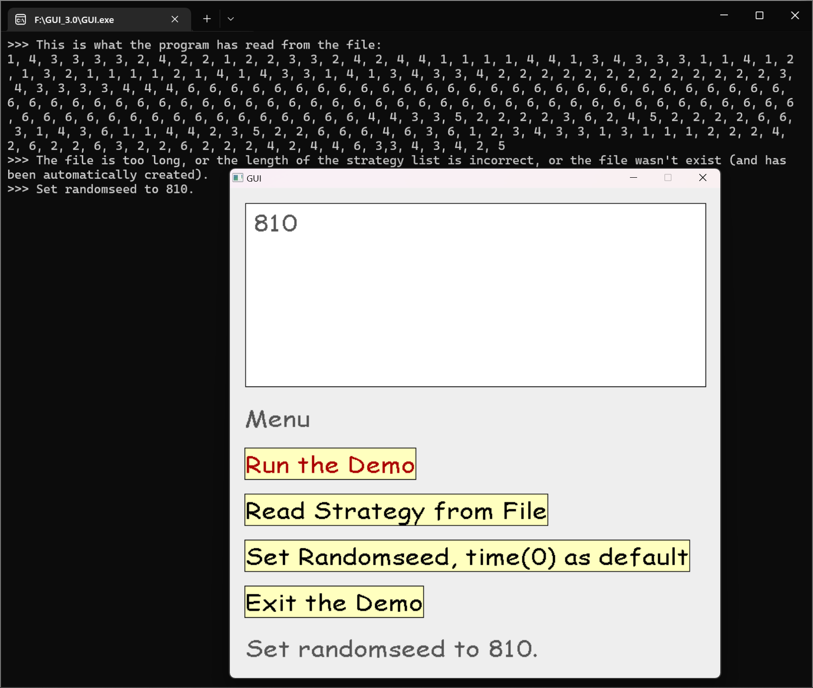

# <!-- fit --> 面向对象和GUI设计简介

复旦大学 2022级 傅全通

---

## 目录

- 演示GUI程序
- 简介面向对象程序设计
- 在C语言里实现面向对象编程
- 转向C++实现简单的面向对象编程
- GUI设计的范式
  （以模型——视图——控制器模式为例）
- 用“几乎是C的C++”设计GUI程序

---

## 面向对象(object-oriented)

*下学期要学，故这里只是简单介绍其重要概念。*

**对象(object，另译作“物件”)** 是对现实生活中的物体或事情的**抽象**。

- 对象包含两个含义：  **数据**和**动作**。对象则是数据和动作的结合体。

- 对象不仅能够进行**操作**，同时还能够及时**记录**下**操作结果**。

**继承**和**多态**稍显复杂，暂不涉及；**封装**将在后面以现实例子重点论说。

---

### （例）如何在C语言里用面向对象设计程序？

*（引2）* 想象一个棋盘代表局势和黑白双方的移动（跟PJ2很像！）。  
这个过程其实是**确定**棋盘中**数据的存储方式**。

```c
typedef enum { EMPTY_SQUARE, WHITE_PAWN /* 其他变量 */}ChessPiece;
typedef enum PlayerColor { PC_WHITE, PC_BLACK }PlayerColor;
typedef struct ChessBoard
{
    ChessPiece board[ 8 ][ 8 ];
    PlayerColor whose_move;
}ChessBoard;
```

提问：为什么在C语言里要用typedef？  
前两个enum的语法有什么区别？

---

创建**操作**棋盘的函数，都把**指向棋盘的指针**作为第一个参数：

```c
ChessPiece getPiece (const ChessBoard *p_board, int x, int y){
    return p_board->board[ x ][ y ];
}
PlayerColor getMove (const ChessBoard *p_board){
    return p_board->whose_move;
}
void makeMove(ChessBoard* p_board,int from_x, int from_y, int to_x, int to_y){
    // 通常情况下，我们首先需要写点代码验证移动棋子的合法性
    p_board->board[to_x][to_y] = p_board->board[from_x][from_y];
    p_board->board[from_x][from_y] = EMPTY_SQUARE;
}
```

提问：为什么这里第一个参数都是指向棋盘的指针？  
为什么前两个函数的指针加了“`* 前的const`”？

---

它们当做其他任何函数一样使用：

```c
ChessBoard b; // 首先需要用后面介绍的 “构造函数” 来恰当地初始化棋盘

getMove( & b );
makeMove( & b, 0, 0, 1, 0 );
```

事实上，C语言程序员使用这种方式已经很多年了。  

然而，这些函数*只是* 与ChessBoard结构体相*关联*，  
因为它们*恰巧* 把ChessBoard作为一个参数。  
没有地方*明确* 表示：“这个函数应该被当做该结构体的核心部分。”  

不过，结构体既包含数据又包含操纵数据的函数，这么做倒挺不错。  
于是这种语法就被加入了C++。

---

### 进阶！“真正的”面向对象

把函数变成方法(C++)：

```cpp
struct ChessBoard{
    ChessPiece board[ 8 ][ 8 ];
    PlayerColor whose_move;
    ChessPiece getPiece (int x, int y){ return board[ x ][ y ]; }
    PlayerColor getMove (){ return this->whose_move; }
    void makeMove (int from_x, int from_y, int to_x, int to_y){
        board[ to_x ][ to_y ] = board[ from_x ][ from_y ];
        board[ from_x ][ from_y ] = EMPTY_SQUARE;
    }
};
```

不难发现，相比*全局函数*，**方法**定义在结构体中，且**隐含`*this`参数**

---

还可以把结构体中的数据**封装**，只暴露其方法，  
这样便符合了(C++中) **类** 的一般形式：

```cpp
class ChessBoard
{
public:
    ChessPiece getPiece(int x, int y);
    PlayerColor getMove();
    void makeMove(int from_x, int from_y, int to_x, int to_y);

private:
    ChessPiece _board[8][8];
    PlayerColor _whose_move;
};
```

---

方法的定义和之前完全相同；  
只不过要加作用域（类名+双冒号），表示其属于该类。

```cpp
ChessPiece ChessBoard::getPiece(int x, int y)
{
    return _board[x][y];
}
PlayerColor ChessBoard::getMove()
{
    return _whose_move;
}
void ChessBoard::makeMove(int from_x, int from_y, int to_x, int to_y)
{
    // 通常情况下，首先需要写点代码验证移动棋子的合法性
    _board[to_x][to_y] = _board[from_x][from_y];
    _board[from_x][from_y] = EMPTY_SQUARE;
}
```

---

### 封装

- 用`private`把不想暴露给外界的**数据**和**内部方法**（通常是一些底层的操作）“保护”起来。

    （引3）封装 意味着隐藏你的实现（封装它），  
    这样使用类的人只需要处理构成类的接口的那一系列方法就行了。  
    也许使用像 “数据隐藏” 或者 “实现细节” 的词组来形容更形象一点，  
    但是“封装”是你会时常遇到的术语。  

观察上面的例子和阅读这段引文，回答：  

- 封装有什么好处？  

---

现在你已经大体知道面向对象是什么样子的，

也看了一个从`C中结构体`改进而来的`C++类`，

这为我们进入GUI设计的讨论铺平了道路。

---

## GUI设计模式

这里介绍Javax.swing提出的  
**模型——视图——控制器**模式  
要求我们提供三个**不同**对象：

- 模型(model):  存储内容。

- 视图(view):   显示内容。

- 控制器(controller):
  处理用户输入，  
  如点击鼠标和按下键盘；  
  然后决定更改模型或视图。

该模式明确地规定了三个对象如何交互。


---

一开始演示的GUI，  

视图背后为控制台（右图），  
其蕴含着模型和控制器。

只需实现**模型**和**控制器**  
（当中的一小部分），  
图形库会我们实现**视图**。

下面以按钮类为例。


---

### 实现button的*模型*，即button类的*数据*部分

```cpp
class button
{
    // 指向void(void)类型函数的指针
    typedef void (*invoker_t)(void);

//按钮的存储数据如下
private:
    int left, top, right, bottom;    // 存储按钮的位置和大小
    std::string/*是字符串*/ title;   // 存储按钮上的文本
    invoker_t invoker;              // 按钮被点击时的响应动作
    COLORREF/*本质是int*/ textcolor; // 存下按钮文本的颜色
```

提问：问什么需要这个难懂的函数指针？  

---

### button的*控制器*

```cpp
public:
    // 构造函数（构造器方法），可以向其传入参数以创建指定的button实例
    button(int left, int top, char *txt, COLORREF txtcol, invoker_t ivk_func);
    
    ~button() {/*析构函数，用于妥善销毁对象。这里用默认或直接不写即可*/}

    // 检查鼠标是否在按钮框内部
    bool check(int x, int y){
        return left<=x && x<=right && top<=y && y<=bottom;
    }

    // 在GUI里绘制按钮的样貌
    void show();

    // 调用响应函数，即处理点击事件
    void on_message() { invoker(); }
};
```

---
类是抽象的，调用构造函数才会创建类的**实例**，即通常说的“对象”。  

可以把这些按钮对象（都是**模型**）放进数组，便于统一操作。  

```cpp
button buttons[] = {
    button(LEFT, BODY_1, "Run the Demo", 
        [&main_screen](void) -> void // 匿名函数
            {
                puts(">>> Clicked \"Run the Demo\".");
                move();        // 切换到演示界面，完全复用PJ1
                main_screen(); // 重新绘制主界面
            },
        RED),
    button(LEFT, BODY_2, "Read Strategy"/*,某个函数*/),
    button(LEFT, BODY_3, "Set Randomseed"/*,某个函数*/),
    button(LEFT, BODY_4, "Exit", []{ closegraph(); exit(0); })};
```

---

现在可以把它们展现在**视图**中

```cpp
for (size_t i = 0; 
    i < sizeof(buttons)/sizeof(button); 
    ++i)
    buttons[i].show();

//C++中简写如下。不深究右值引用
for (auto &&i : buttons) i.show();
```

类似地可以实现文本框类。不再赘述。


---

外层控制器的一般模式：

```cpp
for (ExMessage msg;;)                 // 声明消息变量
{
    msg = getmessage(EM_MOUSE);       // 获取消息输入
    if (msg.lbutton)                  // 如果左键按下
    {
        for (auto &&i : buttons)      // 遍历每个按钮
            if (i.check(msg.x, msg.y))// 光标在按钮框内
                i.on_message();       // 按钮按下事件
        // ...其他控件
    }
}
```

至此，GUI设计简介完成

---

（如果有时间）  
介绍EasyX库——Windows下使用C语法的免费(但不开源)简单图形库  
（至少比SDL简单，而且有详细的中文文档和丰富的实例程序）

旨在帮大家完成PJ中的GUI加分项，因此偏实用。  
`Qt`、`Javax.swing`或者`JavaFX`都是更好的选择，  
但是需要涉及继承、接口等等复杂的面向对象特性，
所以这里介绍面向过程的EasyX。

---

### EasyX获取和安装(略说)

[链接](https://easyx.cn/)

有任意版本Visual Studio的可以直接打开安装包；其他方式：  
[在 CLion、Dev-C++ 或 Code::Blocks 下面配置 EasyX（2022-9-1 更新）](https://codebus.cn/bestans/easyx-for-mingw)

其核心是两个头文件、一个静态库：  
`graphics.h`（继承自Turbo C）、`EasyX.h`，`libEasyX.a`

---

### 创建空白GUI


---

### 常用绘图函数

demo总共只用了这么些函数


---

只需要把PJ1当中的空格全都换成rectangle  
罐子换成方形、小黄换成椭圆即可

如果你想，可以绘制一个可爱的小黄形象，然后加载进去

```C
    // NULL 表示加载到绘图窗口。
    loadimage(NULL, "Yellow.jpeg");
```

---


这样就可以画各种想要的GUI
